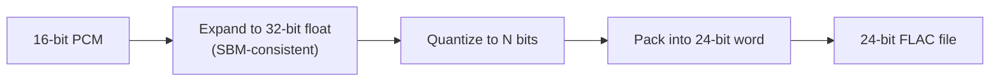

# 20-bit vs 24-bit in SuperMap

Both modes share the same SBM-style expand path in [`src/supermap_cd/gapfill.py`](src/supermap_cd/gapfill.py). The only user-facing fork is the final quantize + pack step controlled by `--bits` / the GUI combo (`20` or `24`).

## Shared pipeline (identical until the last step)



1. Start from Red Book / file PCM (16-bit).
2. Synthesize +16 bits inside each 16-bit bin → 32-bit working float (`expand_to_32bit_float`).
3. Re-project for CD consistency, then quantize to **N** bits (`quantize_sbm_output`).
4. Pack into a **24-bit FLAC** container (`pack_bits_to_int24` → `write_flac`).

So: **file format is always 24-bit FLAC**; “20-bit” means fewer meaningful LSBs inside that container.

## Concrete difference

| Aspect | 24-bit | 20-bit |
|--------|--------|--------|
| Quantize depth | Full 24 bits of amplitude resolution | 20 bits only |
| Packing | Identity (shift 0) | Left-aligned: `sample << 4` |
| Low 4 bits of each sample | Can be nonzero | Always `0` (by construction) |
| Dynamic range (ideal) | ~144 dB theoretical | ~120 dB theoretical |
| Default in CLI/GUI | Yes (`default=24`) | Opt-in |
| Tags / DESCRIPTION | Says `24-bit` | Says `20-bit` |

Packing logic ([`pack_bits_to_int24`](src/supermap_cd/gapfill.py)):

```python
shift = 24 - bits   # 0 for 24-bit, 4 for 20-bit
return (samples << shift)
```

Tests assert the 20-bit contract: `(out20 & 0xF) == 0` ([`tests/test_gapfill.py`](tests/test_gapfill.py)).

## What this means in practice

- **24-bit**: Keep more of the synthesized high-res detail after expand. Closest to “full” SuperMap output depth inside a normal 24-bit FLAC.
- **20-bit**: Coarser final grid (16× larger quantization steps than 24-bit). Noise-shaped error is concentrated in fewer usable bits; the bottom 4 bits of the FLAC word are unused padding. Historically closer to some Sony SBM / high-res marketing depths; still stored as standard PCM_24 so players treat it as 24-bit.

Neither mode recovers a studio master. Both invent high-res content *consistent with* the 16-bit source under the SBM-like model (README honesty note).

## Where the choice is exposed

- CLI: `--bits {20,24}` in [`src/supermap_cd/cli.py`](src/supermap_cd/cli.py)
- GUI: “24-bit FLAC” / “20-bit (in 24-bit FLAC)” in [`src/supermap_cd/gui.py`](src/supermap_cd/gui.py)
- Pipeline option: `output_bits` in [`src/supermap_cd/pipeline.py`](src/supermap_cd/pipeline.py)

## Decision guide (no code changes)

- Prefer **24-bit** for maximum retained expand detail and the project default.
- Prefer **20-bit** if you want the left-aligned / SBM-era style output with explicit unused LSBs, or smaller effective amplitude resolution after shaping.
